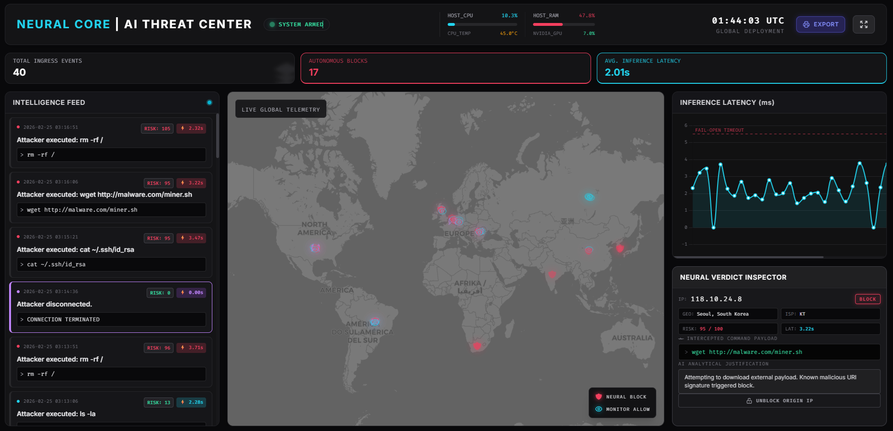
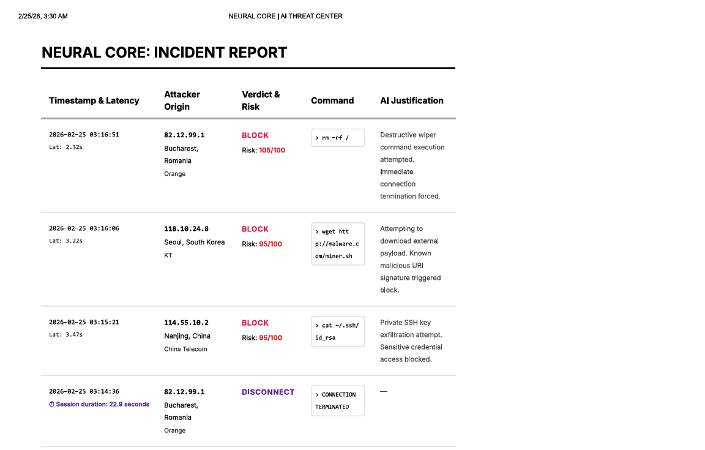

# Distributed SSH Honeypot with Real-Time AI



This project is a highly sophisticated, distributed SSH honeypot network designed to actively engage attackers, intercept their keystrokes, and autonomously block them in real-time using a completely private Local LLM architecture.

## Overview

The system is split into two distinct physical components communicating seamlessly over your Local Area Network (LAN):

1. **The Edge Sensor (Raspberry Pi or Edge VM)**
   - Runs a lightweight, containerized Python fake SSH server utilizing `paramiko`.
   - Mimics a vulnerable Linux server handling authentication, building a dummy filesystem, and parsing active shell sessions (`ls`, `whoami`, `pwd`, etc.).
   - Orchestrates telemetry via a Controller Service that aggregates traffic and requests AI intervention.

2. **The AI Brain Server (Windows PC or High-VRAM Host)**
   - Houses a permanent Flask API endpoint listening globally on port `6001`.
   - Connects locally to high-performance AI models (e.g., **Llama 3** via Ollama) specifically prompted for cybersecurity analysis.
   - Evaluates complex attacker behavioral profiles, detects intent (Reconnaissance, Credential Stuffing, Botnet Brute Force), and returns structured JSON verdicts to the Edge Sensor to instantaneously block or intentionally deceive the attacker.

## Operational Modes

The Edge Sensor can be configured via environment variables in `docker-compose.yml` (`ALLOW_ALL_CREDS`):
1. **Low-Interaction (Brute-Force Shield):** Rejects all standard passwords and aggressively issues network-wide permanent IP bans on users failing consecutive logins. 
2. **High-Interaction (Total Deception):** Accepts ANY password and invites the attacker into the completely sandboxed virtual shell to record interactive payloads and techniques.
3. **Hybrid (Targeted Deception):** Defaults to blocking brute force scripts but leaves specific *Bait Credentials* (`admin`/`admin` or `root`/`1234`) active. Sophisticated attackers who guess these baits are quietly granted access to the virtual shell, providing rich intelligence on human targeting without exposing the honeypot to noisy botnet traffic.

## Real-Time AI Deception Features

- **Pre-Execution Inference:** Shell commands are held synchronously while the `brain_server` queries the LLM for malicious intent.
- **Dynamic Decoy Generation:** If a benign command (e.g., `ls` or `cd`) is evaluated as safe exploration, the AI Brain will hallucinate enticing "bait" files (e.g., `passwords.txt`) and dynamically inject them into the in-memory fake filesystem to increase dwell time.
- **Zero-Latency Enforcement:** Destructive commands instantly trigger a global IP ban and forcefully terminate the SSH wrapper.
- **Fail-Open Strategy:** If the AI Brain crashes or takes longer than 5.5 seconds to answer, the Honeypot safely fails open ("ALLOW") to preserve the illusion that the attacker is successfully exploring the system.

## Setup & Deployment

### 1. The Windows AI Brain Server
Make sure you have [Ollama](https://ollama.com/) installed and the `llama3` model pulled locally (`ollama run llama3`).
```bash
# Start the AI Brain Server
python src/brain_server.py
# The server will establish its connection on http://0.0.0.0:6001
```

### 2. The Edge Sensor Network (Raspberry Pi)
The Honeypot and Controller are heavily containerized for identical deployments. Ensure Docker and Docker Compose are installed on the Raspberry Pi.
1. Map your Brain Server IP inside the Pi's `docker-compose.yml` file (`BRAIN_URL=http://<YOUR_WINDOWS_PC_IP>:6001/analyze`).
2. Deploy the containers:
```bash
# Push your code to the Pi (using the included deploy script)
python scripts/deploy_to_pi.py

# Or manually run Docker Compose on the Pi:
sudo docker compose up -d --build
```

### 3. Monitoring & Incident Export
You can monitor live logs gracefully from the Edge Sensor without locking up your terminal by omitting the follow flag:
```bash
sudo docker compose logs --tail=100
```
Offline structured analytics representing systemic network incidents are aggressively aggregated inside `full_incident_report.json` and `behavior_report.json` respectively.

#### Professional PDF Export
The Neural Core UI includes a streamlined, print-ready PDF export function. You can instantly produce executive-ready incident reports containing attacker origin, inferred malicious intent, and real-time inference latency. 
Simply click the **EXPORT** button in the dashboard or hit `Ctrl+P` (Windows) / `Cmd+P` (Mac).



## Key Design Principles
- **No Latency Architecture:** The `brain_server` actively forces the Llama 3 model to remain hot in VRAM (`"keep_alive": -1`) ensuring sub-second inference even if days pass between attacks. Prompts are aggressively truncated to strictly maintain inference speeds under 2.0 seconds.
- **Microservices Orchestration:** A single central deployment can comfortably track and ingest data from dozens of identical Raspberry Pi container instances across disparate subnets seamlessly.
- **Offline Security:** By strictly utilizing local instances of Llama 3 instead of a proxy like the Mistral Cloud API, your behavioral profiles avoid third-party exposure and rate limit vulnerability.

## Testing & Demos
For complete step-by-step instructions on triggering and testing the AI blocking and dynamic deception functionality, please reference `testing_guide.txt`.
